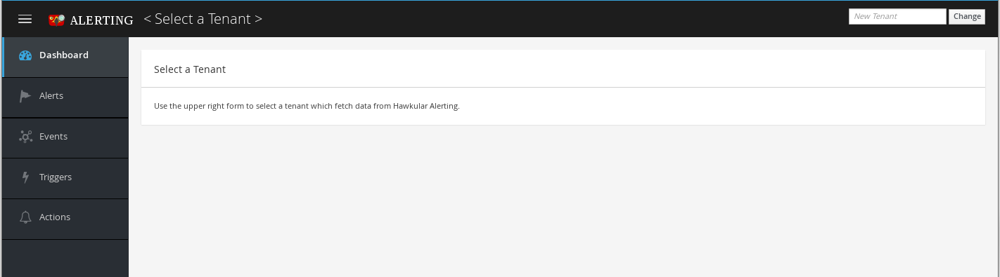
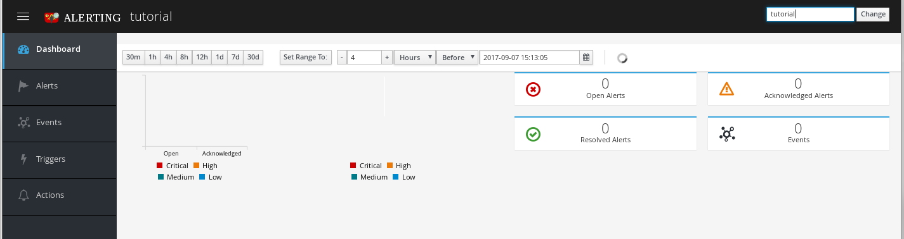
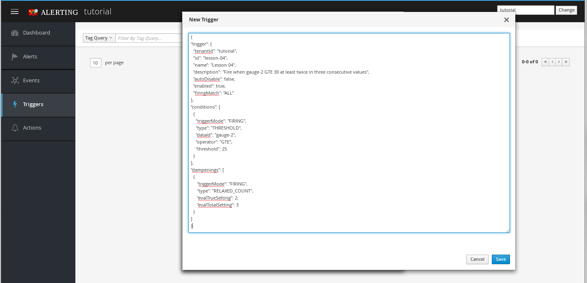
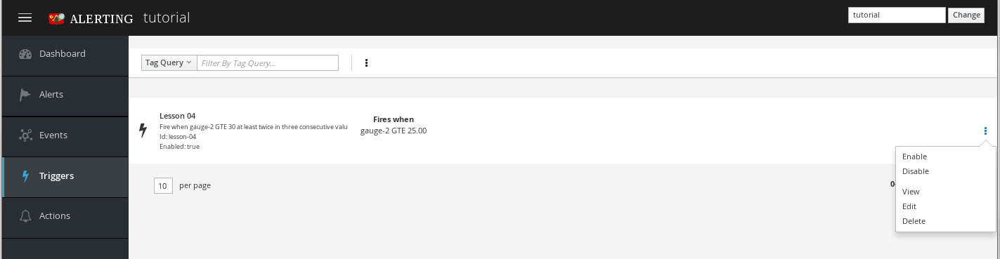
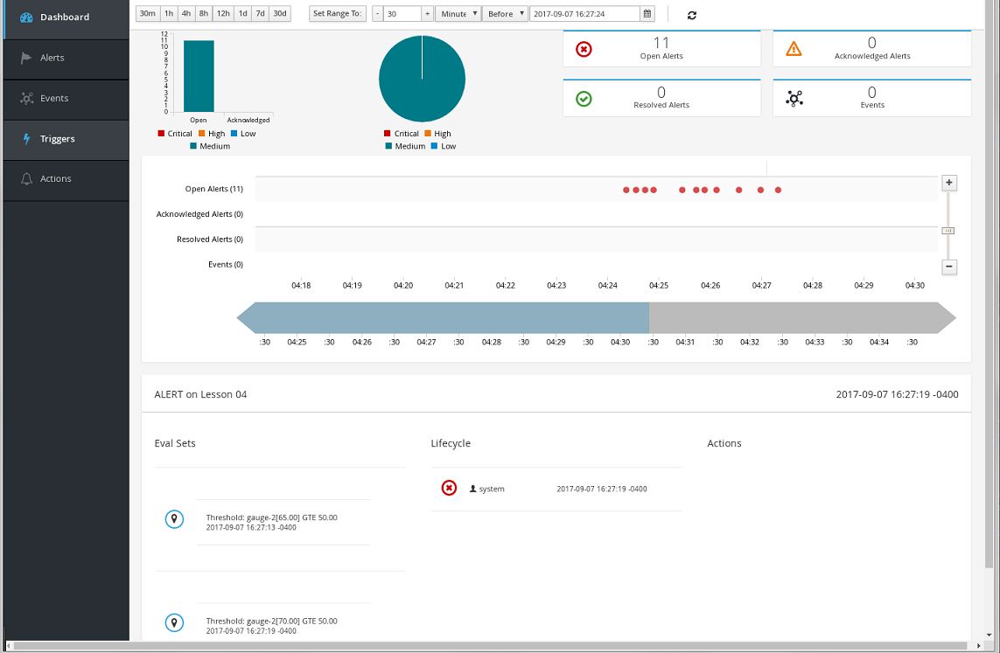
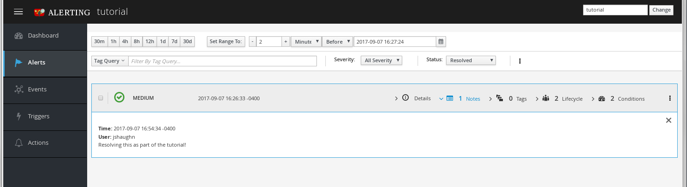

== Lesson 04 - UI

Starting with version 2.0 hAlerts comes with an out-of-the-box UI.  This gives you a way to visualize your alerts and events, as well as to see and edit your trigger and action definitions. (More on events and actions in future lessons.)

If you have completed previous lessons then the UI may already have some data to work with.  If not, we'll add some new things now.  The future lessons work solely with the REST API but after completing this lesson you will also be able to use the UI, as you desire.

=== The UI Layout

To access the UI start a browser and enter the url `http://localhost:8080/hawkular/alerts/ui`, substituting host or port as needed.  You should see something like:



You can see the general layout with different views available via the left-side accordian and a main content area.  In the top-right corner is an area to set the current tenant.  Initially it is unset.  Go ahead and set the tenant to _tutorial_ and then click the `Change` button.

The default view is the Dashboard.  If you have alerts from the last couple of tutorials you may already have something in your display.  But otherwise you should see a buch of zeros reflected in the counts, like below:



There isn't much to see just yet, but notice that the time-window for which the dashboard displays data is configurable via the range selector above the content area.  There are preset time windows that can be selected to the left, or a completely custom datetime range using the widgets to the right.  This range selector is used in other views as well.  Note that to the right of the range selector is a spinner. When spinning the dash auto-updates every few seconds.  Auto-update can be toggled by clicking the spinner.  Disable auto-update when you want to manipulate the timeline, inspect alert details, or set a custom range. When disabled custom range changes are applied via the `Set Range To` button.

=== Triggers View

Let's generate some alerts to make the dash more interesting.  Instead of making REST requests we can perform a variety of tasks in the UI, including processing our full-trigger JSON.  To create a trigger do the following:

. Click `Triggers` in the left-side accordion
** Your trigger list will be empty unless you have some data from previous lessons.
. Click the kebab (3 vertical dot icon) just right of the `Tag Query` filter.
. Click the `New Trigger` option.
** This will bring up the New Trigger dialog box.
. Enter the following trigger body into the dialog:

[cols="1,5l"]
```
{
"trigger": {
  "tenantId": "tutorial",
  "id": "lesson-04",
  "name": "Lesson 04",
  "description": "Fire when gauge-2 GTE 50 at least twice in three consecutive values",
  "autoDisable": false,
  "enabled": true,
  "firingMatch": "ALL"
},
"conditions": [
  {
    "triggerMode": "FIRING",
    "type": "THRESHOLD",
    "dataId": "gauge-2",
    "operator": "GTE",
    "threshold": 50
  }
],
"dampenings": [
  {
     "triggerMode": "FIRING",
     "type": "RELAXED_COUNT",
     "evalTrueSetting": 2,
     "evalTotalSetting": 3
  }
]
}
```

When your screen looks like the following, click `Save`.



If successful you should now see an entry in your trigger list for the newly created trigger.  Note that each list entry represents one trigger and each has a kebab you can click to work on that particular trigger.  If you click the kebab you should see something like this:



You can enable/disable the trigger from here and you can also perform the various CRUD operations: view, edit/update, and delete.  Note that we are always working with full trigger definitions in the UI.  So an edit affects conditions and dampening as well as the trigger fields.


=== Dashboard Timeline

Let's generate some alerts by starting the data-pump.  Note that `autoDisable=false` so our trigger will keep firing until we manually disable it or stop the data-pump.

First, navigate back to the dashboard in the UI and set the time range to 30 minutes by clicking the `30m` button. Then:

`> ./tutorial-data.sh`

Before long you should start to see alerts appear on the dash, and when they do you a few things should happen:

* The charts will start to show data.
* The counts will start to increment.
* The timeline will appear with dots representing alerts.

When you have a few alerts stop the auto-refresh by clicking the spinner just right of the range filter. This will allow you to better play with the timeline zoom without it snapping back every few seconds when it refreshes.  Try zooming in and then click on one of the dots representing an alert.  You should see the alert detail below.  The screen should look something like:



You can re-enable auto-refresh by again clicking the spinner.  You will likely have a few more alerts.  To stop the alert generation we could stop the data-pump but for fun go back to the triggers view and use the `Disable` option in the trigger's kebab.


=== Alerts View

After disabling the trigger click on the `Alerts` view.  This will bring you to the alerts list.  In addition to the range filter there are a variety of other filters you can apply here.  Also, you can see that each alert entry has several expansions to show various details.  Expand `Conditions` to see the data that caused the alert to be generated.

You may see some things here that have yet to be fully introduced to this point in the tutorials.  Lifecycle status will be introduced in the next lesson, and other things will follow suit.  For now, ignore things that seem confusing, although we will play with lifecycle a bit right now...

Like with the triggers list, each alert entry has a kebab.  From the kebab menu you can view the entire alert JSON or delete the alert.  You can also manage the alert lifecycle by acknowledging, resolving or annotating the alert.  Go ahead and try the various options. Ack an alert and resolve an alert.  The changes should be reflected immediately in the list. The notes will show up in the expansion.

Now, try filtering on status.  Select `Resolved` from the Status dropdown. You should see something like this after performing these steps:




=== The UI and Future Lessons

The lessons always present the necessary REST requests used to perform the desired actions.  But feel free to use the UI as you see fit. We have seen that, given the JSON, the UI provides an easy way to list, create, delete and update triggers.  It can present a dashboard view of alert activity, and gives us an ability to list, inspect and manipulate alerts.


When you are ready, move on to the next lesson.

link:lesson-05-lifecycle.adoc[Lesson 05 - Alert Lifecycle and Auto-Resolve]

link:../README.adoc[Tutorial Home]

