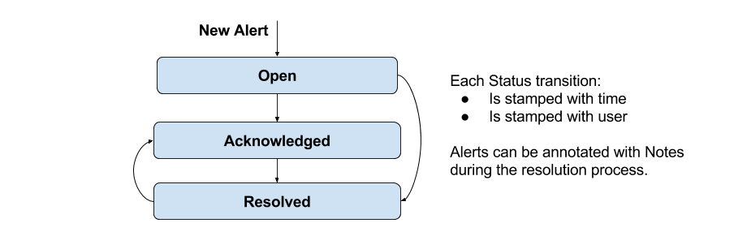

== Lesson 06 - Actions

In the previous lessons we've learned how to define a trigger, have it fire an alert, and then how to move that alert through its life-cycle to resolution.  But in most cases we need to perform some actions in response to an alert.  Some examples:

* Notify an administrator
** e-mail, irc
* Integrate with external system
** snmp, aerogear, pager-duty
* Execute a webhook

Hawkular Alerting provides all of the above (and more) as action plugins.  It is also possible to create custom action plugins.

Actions are tied to life-cycle.  Most actions are performed when an alert is created and moved to OPEN.  But hAlerting also allows actions to be performed on any life-cycle state transistion.  Revisiting the diagram from lesson-05, we can perform actions on any of the arrow transitions:

Actions are reusable.  They are defined once and then can be assigned to one or more triggers.  For example, I can create an action to perform a webhook.  I may want to have that webhook apply to many triggers, both when the alerts are acknowledged and when they are resolved. If I then update the webhook URL it will apply automatically to all of the assigned triggers.

=== E-Mail Action Example

In this example we will define a trigger with e-mail actions to be executed when we OPEN a new alert and also when it moves to RESOLVED.  We will use different e-mail addresses for each. First we define the actions and then we assign and configure the actions for use by our trigger.

==== SMTP Server and Timezone

Before anything else let's establish an SMTP server.  You can configure an existing SMTP server if one is available. Otherwise with this tutorial we use FakeSMTP to handle the outgoing e-mail.

1) http://nilhcem.com/FakeSMTP/[Download and install FakeSMTP] as directed.

2) Edit `lessons/config.properties` and set `mail.smtp.host=<your host>`.  If for some reason port 2525 is in use you can also enter a different port.

3) Make sure your timezone is configured so that TimeConstraints (explained below) work as expected (docker containers run in UTC TZ by default)

`> echo $TZ`

If your `TZ` environment variable is already set you should be fine, and can skip this step. Otherwise:

`> export TZ=<your timezone>`

If you are unsure of what your timezone setting should be, execute `timedatect1` and use the result, as shown below:

----
> timedatectl | grep zone
       Time zone: America/New_York (EST, -0500)
> export TZ=America/New_York
----

4) To pick up your updated SMTP and timezone settings you'll need to restart the docker containers (Tip: ctl-c works for stopping a running docker-compose):

----
> docker-compose down
> docker-compose up
----

5) In a different window, start your FakeSMTP server. Remember to set the port correctly (e.g. 2525) and click the "Start Server" button.

----
> cd <FakeSMPTTargetDirectory>
> sudo java -jar fakeSMTP-<VERSION>.jar
----

==== Action Example

Now that FakeSMTP and our properly configured containers are running, let's create two actions, one that notifies admins and one that notifies supervisors:

[cols="1,5l"]
|===
|Request
|POST http://localhost:8080/hawkular/alerts/actions

|HTTP Headers
|Hawkular-Tenant: tutorial
Content-Type: application/json

|Body
|
{
  "actionPlugin": "email",
  "actionId": "notify-admins",
  "properties": {
    "to": "admins@hawkular.org",
    "cc": "developers@hawkular.org"
  },
  "states": ["OPEN"]
}
|===

[cols="1,5l"]
|===
|Request
|POST http://localhost:8080/hawkular/alerts/actions

|HTTP Headers
|Hawkular-Tenant: tutorial
Content-Type: application/json

|Body
|
{
  "actionPlugin": "email",
  "actionId": "notify-supervisors",
  "properties": {
    "to": "supervisors@hawkular.org"
  },
  "states": ["RESOLVED"]
}
|===

Note that each plugin defines its own plugin-specific properties.  Here we use the `to` and `cc` properties supported by the email plugin.

Now, let's define a trigger.  We'll introduce another built-in condition type for this trigger, the COMPARE condition.  This condition is used to compare different metrics. A common example is to compare a "used" metric to a "max" metric. For example: `(HeapUsed > 80% HeapMax)`. Our example is a bit more contrived, we'll just compare our gauge-1 and gauge-2 metrics in an arbitrary way.  And we'll auto-resolve in a similar fashion. We'll use default dampening for both trigger modes.

For Firing we'll use `(gauge-1 < 25% of gauge-2)`.

For Auto-Resolve we'll use `(gauge-1 > 200% of gauge-2)`.

[cols="1,5l"]
|===
|Request
|POST http://localhost:8080/hawkular/alerts/triggers/trigger

|HTTP Headers
|Hawkular-Tenant: tutorial
Content-Type: application/json

|Body
|
{
"trigger": {
  "tenantId": "tutorial",
  "id": "lesson-06",
  "name": "Lesson 06",
  "description": "Use COMPARE condition to fire alerts with e-mail actions.",
  "autoResolve": true,
  "enabled": true,
  "actions":[
  {
    "actionPlugin": "email",
    "actionId": "notify-admins"
  },
  {
    "actionPlugin": "email",
    "actionId": "notify-supervisors"
  }
  ]
},
"conditions": [
  {
    "triggerMode": "FIRING",
    "type": "COMPARE",
    "dataId": "gauge-1",
    "operator": "LT",
    "data2Multiplier": 0.25,
    "data2Id": "gauge-2"
  },
  {
    "triggerMode": "AUTORESOLVE",
    "type": "COMPARE",
    "dataId": "gauge-1",
    "operator": "GT",
    "data2Multiplier": 2.00,
    "data2Id": "gauge-2"
  }
]
}
|===

OK, it's time to turn on the data pump until we fire an alert, and then auto-resolve.

`> ./tutorial-data.sh`

Let's intermittently check for resolved lesson-06 alerts. We can do this by adding one more fetch criteria to the request:

[cols="1,5l"]
|===
|Request
|GET http://localhost:8080/hawkular/alerts?triggerIds=lesson-06&statuses=RESOLVED

|HTTP Headers
|Hawkular-Tenant: tutorial
Content-Type: application/json
|===

When you get a hit turn off the data pump, unless you want to generate more than one alert.  Remember, the trigger will be enabled for firing after it is auto-resolved. As an exercise, examine the resolved alert to get more familiar with the COMPARE condition.  But for this lesson we are interested in the e-mail actions.  You should see e-mail in your FakeSMTP GUI (or real e-mail if you had configured to use a real SMTP server with real mail addresses).

image::image-fakesmtp.png[FakeSMTP]

===== Time Constraints

It is often the case that different actions apply to different times during the day, different days of the week, etc.  A primary configuration option for a TriggerAction is to add a http://www.hawkular.org/docs/rest/rest-alerts.html#TimeConstraint[Time Constraint].  These are very flexible, refer to the http://www.hawkular.org/docs/rest/rest-alerts.html#TimeConstraint[documentation] for a full description.  Let's introduce them in our example by having daytime admins and on-call admins.

To do this we'll update our `notify-admins` action to perform only during business hours.  And we'll add a new action for sending e-mail to the on-call admins outside of business hours.

[cols="1,5l"]
|===
|Request
|PUT http://localhost:8080/hawkular/alerts/actions/notify-admins

|HTTP Headers
|Hawkular-Tenant: tutorial
Content-Type: application/json

|Body
|
{
  "actionPlugin": "email",
  "actionId": "notify-admins",
  "properties": {
    "to": "admins@hawkular.org",
    "cc": "developers@hawkular.org"
  },
  "states": ["OPEN"],
  "calendar": {
    "startTime":"Mon,09:00",
    "endTime":"Fri,18:00",
    "relative": true,
    "inRange": true
  }
}
|===

[cols="1,5l"]
|===
|Request
|POST http://localhost:8080/hawkular/alerts/actions

|HTTP Headers
|Hawkular-Tenant: tutorial
Content-Type: application/json

|Body
|
{
  "actionPlugin": "email",
  "actionId": "notify-on-call",
  "properties": {
    "to": "on-call@hawkular.org"
  },
  "states": ["OPEN"],
  "calendar": {
    "startTime":"Mon,09:00",
    "endTime":"Fri,18:00",
    "relative": true,
    "inRange": false
  }
}
|===

Now, let's add the new action to our trigger:

[cols="1,5l"]
|===
|Request
|PUT http://localhost:8080/hawkular/alerts/triggers/lesson-06

|HTTP Headers
|Hawkular-Tenant: tutorial
Content-Type: application/json

|Body
|
{
  "tenantId": "tutorial",
  "id": "lesson-06",
  "name": "Lesson 06",
  "description": "Use COMPARE condition to fire alerts with e-mail actions.",
  "autoResolve": true,
  "enabled": true,
  "actions":[
  {
    "actionPlugin": "email",
    "actionId": "notify-admins"
  },
  {
    "actionPlugin": "email",
    "actionId": "notify-on-call"
  },
  {
    "actionPlugin": "email",
    "actionId": "notify-supervisors"
  }
  ]
}
|===

====== Timezones

TIP: Before we turn on the data pump, a note about timezones and TimeConstraint.  Unless timezone is specified on the TimeConstraint it will use the default timezone.  This can lead to unpredictable results because the alerting server could be running in an unexpected timezone, distributed servers could be in different timezones, and containers often run in the UTC timezone, not the timezone of the host.

At the beginning of this lesson we ensured our tutorial container was configured to use the local timezone.  And as such we have not applied timezones to the TimeConstraint definitions.  If you are sure of your environment it may not be necessary, but it is recommended practice.  (Note: TimeConstraint supports a timezone field starting with hAlerting 1.6.0)

OK, back to our example. As above, turn on the data pump until we fire an alert.  Monitor your FakeSMTP GUI and you should see e-mail notifications.  If you execute this during business hours you should see email to admins@hawkular.org, otherwise on-call@hawkular.org.  As an exercise, you can update your action definitions such that you see e-mail to the other address.

==== Global Actions

Global action definitions are exactly like non-global action definitions with the exception that they execute on all alerts. So, as long as the state and time constraints are satisfied the action will be executed without needing to be assigned to the trigger.  This is useful if you have standard actions to apply to all of your alerts.

Let's see this in action by defining a simple global action that just sends email to an auditing address, for every alert on every state transition:

[cols="1,5l"]
|===
|Request
|POST http://localhost:8080/hawkular/alerts/actions

|HTTP Headers
|Hawkular-Tenant: tutorial
Content-Type: application/json

|Body
|
{
  "actionPlugin": "email",
  "actionId": "audit",
  "properties": {
    "to": "audit@hawkular.org"
  },
  "global": true
}
|===

We won't assign this to any trigger, just go ahead and turn on the data pump, then look at the SMTP GUI for new email...  You should now see that every time we get an e-mail for one of our lesson-06 trigger actions, we're also now seeing an audit e-mail.  Note that if you had triggers lying around from older lessons you may even get some audit e-mails for those as well, if they fire.

Global actions can also be very useful for custom plugins where you'd like to have every alert processed in some way, custom to your use cases.

==== Wrap-Up

This introduction to actions should be enough to get you going.  But with the provided plugins and the ability to build custom plugins, the possibilities are nearly endless. Here are some more materials to investigate, if you feel the desire:

Here is a short https://github.com/hawkular/hawkular-alerts/tree/master/examples/webhook[example showing the webhook plugin].

Here are some instructions for http://www.hawkular.org/community/docs/developer-guide/alerts-v2.html#_actions_plugins[building a custom plugin].

Otherwise, it's time to move on...

link:lesson-07-events.adoc[Lesson 07 - Events]

link:../README.adoc[Tutorial Home]

