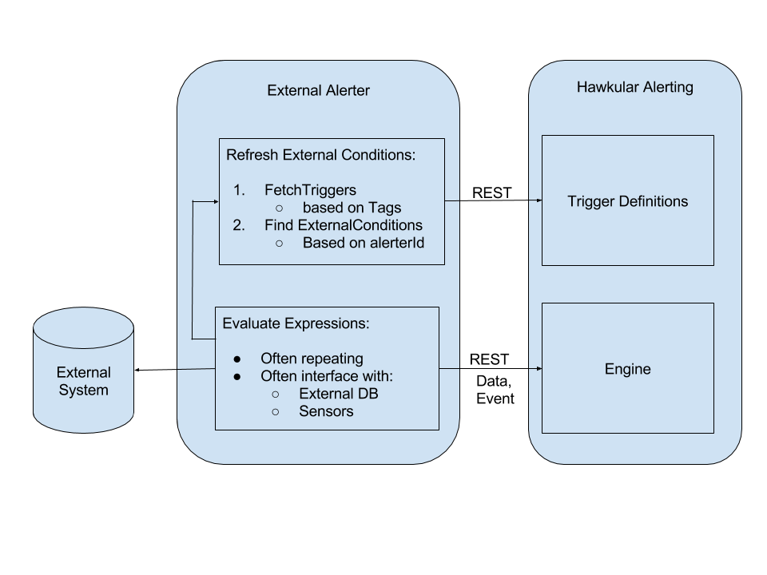

== Lesson 08 - External Alerters

We've now learned how Hawkular Alerting (hAlerting) processes incoming data to generate alerts and events.  In the previous lesson we also saw how events can be injected directly from clients, adding an external element to our processing.  In this lesson we learn how to further extend our processing model by introducing __External Alerters__.

A major differentiator of Hawkular Alerting is that it is a standalone alerting component. It is not targeted for use only with one emcompassing product, but as a federated alerting solution, capable of integrating data from multiple sources.  It is packaged with Hawkular Metrics for the convenience of combining a [Cassandra-based] TSDB with alerting, but hMetrics is not required. In fact, hAlerting doesn't really care where the incoming data comes from; it is free to evaluate conditions streaming in (via REST) from multiple clients.

Not only can hAlerting consume data from multiple clients, it can perform condition evaluation on various types of data: numeric, availability, and events. But there are times when hAlerting's condition types may not exactly fit the problem space, or when streaming of the data itself may be inefficient or impossible.  In these situations we can turn to an __External Alerter__ to extend our model.

=== External Alerter

An external alerter is an hAlerting client responsible for pushing data that already represents some sort of matched condition.  Put another way, it acts like an extension of the condition types hAlerting offers out-of-the-box.  For example, an external alerter may evaluate complex queries against persisted data, or perhaps interface with sensors or alarms.  An external alerter evaluates each __ExternalCondition__ for which it is responsible.

=== ExternalCondition

External integration begins with standard triggers. In this way we immediately get everything that triggers offer: actions, dampening, lifecycle, auto-resolve, etc. The difference is that instead of the typical condition types (e.g. Threshold), we can use an ExternalCondition. An ExternalCondition is like other conditions in that it has a `dataId` with which it matches data sent into Hawkular Alerting. But ExternalCondition also has `alerterId` and `expression` fields. The `alerterId` is used to identify the external alerter for which the condition is relevant. The `expression` field is an alerter-specific expression that defines what the alerter is looking for. For example, let's say we have an alerter that interfaces with a series of temperature sensors. It may know how to handle something like: `ExternalCondition(alerterId:"TempSensor", expression:"SensorHot", dataId:"sensorAlarm"`).  If the sensor08 alarm is detected the alerter would send something like `Data(dataId:"sensorAlarm", value:"Sensor 08 Temperature 212F").

=== Metrics Alerter Example

Hawkular Metrics already comes bundled with a powerful external alerter.  It lets you define queries against the persisted metrics, evaluating expressions.  This gives an hMetrics user the ability to perform stream-based and query-based alerting.  We'll use this alerter for our example.

Before continuing, take a few minutes now to http://www.hawkular.org/hawkular-metrics/docs/user-guide/#_query_based_alerting[read about query-based alerting with the hMetrics alerter].

TIP: It can be easier to generate the hMetrics alerter expression string. `ExternalCondition.expression` is a string field.  The Metrics Alerter expressions can be fairly complex JSON.  See __Generating the JSON__ section in the hMetrics alert guide (the link above).

==== Trigger that Uses ExternalCondition

Below is a trigger that combines streaming and query-based data.  It will fire when we see a high data point for gauge-2 in combination with generally low values for gauge-1. For gauge-1 we'll use an alerter expression to look for a reasonably low median over the last 45s of data.  Here is the expression JSON we'll use in the ExternalCondition (it is condensed to a single string in the REST request below, so it is easier to see here):

[cols="1,5l"]
|===
|Expression JSON
|
{
"queries": [
  {
    "name": "qNow",
    "type": "gauge",
    "metrics": [
      "gauge-1"
    ],
    "percentiles": [
      "60"
    ],
    "duration": "45s"
  }
],
"frequency": "15s",
"evalType": "ALL",
"eval": "(q(qNow, %60) < 40)"
}
|===

This definition says that every 15 seconds, query the last 45 seconds of gauge-1 data, and if the 60th percentile < 40 (roughly 60% of the data points less than 40) evaluate to true.

[cols="1,5l"]
|===
|Request
|POST http://localhost:8080/hawkular/alerts/triggers/trigger

|HTTP Headers
|Hawkular-Tenant: tutorial
Content-Type: application/json

|Body
|
{
"trigger": {
  "tenantId": "tutorial",
  "id": "lesson-08-trigger",
  "name": "Lesson 08 Trigger",
  "description": "Generates an alert on low median and high data point",
  "autoDisable": true,
  "enabled": true,
  "firingMatch": "ALL",
  "tags": {
    "HawkularMetrics": "MetricsCondition",
    "lesson": "8"
  }
},
"conditions": [
  {
    "triggerMode": "FIRING",
    "type": "EXTERNAL",
    "alerterId": "HawkularMetrics",
    "dataId": "alerterExpression01",
    "expression": "{\"queries\": [{\"name\":\"qNow\", \"type\":\"gauge\", \"metrics\":[\"gauge-1\"], \"percentiles\":[\"60\"], \"duration\":\"45s\"}], \"frequency\":\"15s\", \"eval\":\"(q(qNow,%60) < 40)\"}"
  },
  {
    "triggerMode": "FIRING",
    "type": "THRESHOLD",
    "dataId": "gauge-2",
    "operator": "GTE",
    "threshold": 70
  }
]
}
|===

Some things to note about the Trigger:

* It is tagged such that it can be found and processed by the hMetrics alerter.
** Only triggers tagged with "HawkularMetrics": "MetricsCondition" will be fetched by the alerter.
** Each external alerter can define its own required tags to be used for identifying relevant triggers.
* The alerterId is "HawkularMetrics" and is assigned to the ExternalCondition.
** Only ExternalConditions with the "HawkularMetrics" alerterId will be processed by the hMetrics alerter.
** It is possible to have ExternalConditions for different external alerters for the same trigger.
** Each external alerter defines its own unique alerterId.
* The dataId assigned to the ExternalCondition must then be applied to the Data sent by the alerter on a true evaluation.

TIP: HMetrics alerter queries can be performed against multiple metrics, either explicitly listed or the result of a tagQuery.

==== Running the Example

So now we have the trigger that can generate an alert.  To fire it needs to match two different conditions, one based on streaming data and one based on external condition evaluation.  Turn on the data pump.

`> ./tutorial-data.sh`

It may take a few minutes to generate an alert. Given the two conditions we need a recent set of gauge-1 data points containing fairly low numbers, as well as a higher gauge-2 data points at about the same time...

[cols="1,5l"]
|===
|Request
|GET http://localhost:8080/hawkular/alerts?tagQuery=lesson=8

|HTTP Headers
|Hawkular-Tenant: tutorial
Content-Type: application/json
|===

When an alert is fired take a good look at the evalSets.  You will see something like:

[cols="1,5l"]
|===
|EvalSet Snippet:
|
{
  "evalTimestamp": 1494448916223,
  "dataTimestamp": 1494448913136,
  "type": "EXTERNAL",
  "condition": {
    "tenantId": "tutorial",
    "triggerId": "lesson-08-trigger",
    "triggerMode": "FIRING",
    "type": "EXTERNAL",
    "conditionSetSize": 2,
    "conditionSetIndex": 1,
    "conditionId": "tutorial-lesson-08-trigger-FIRING-2-1",
    "alerterId": "HawkularMetrics",
    "dataId": "alerterExpression01",
    "expression": "{
      "queries": [{
        "name":"qNow",
       "type":"gauge",
       "metrics":["gauge-1"],
       "percentiles":["60"],
       "duration":"45s"}],
       "frequency":"15s",
       "eval":"(q(qNow,%60) < 40)"
    }"
  },
  "event": {
    "eventType": "EVENT",
    "tenantId": "tutorial",
    "id": "15ac28c2-1e29-43c9-92a2-cf8cd0670ad7",
    "ctime": 1494448913136,
    "dataSource": "_none_",
    "dataId": "alerterExpression01",
    "category": "MetricsCondition",
    "text": "{q(qNow,%60)=16.0}"
  }
}
|===

Some things to note about the EvalSet snippet:

* You can see that the hMetrics alerter actually sends an Event when an expression evaluates to true.
** An alerter can send Data or an Event, whichever sems most suitable.
* As always, the evalSet includes the condition so that the original expression is supplied.
* The alerter should supply the expression evaluation result.
** The hMetrics alerter supplies the evaluation information in the Event.text field:
*** `"text": "{q(qNow,%60)=16.0}"`
** Data.value is appropriate for alerters sending Data.

=== Writing your own External Alerter

An external alerter can be as simple or complicated as necessary.  It can be written in any language and typically interacts with hAlerting via the REST API. The diagram below shows the basic architecture:

The hMetrics alerter used in this lesson is available as an example.  It is an imperfect example because of the tight integration between Hawkular Metrics and Alerting.  Because the alerter is deployed alongside alerting, it utilizes Java API as opposed to REST API.  This is atypical and you should implement your alerter to be deployed externally, and  use the REST API.  But, for a general idea, you can https://github.com/hawkular/hawkular-metrics/tree/master/alerting/alerter-war[look here at the hMetrics alerter].

=== Next

When you are ready, move on to the next lesson.  It introduces Group Triggers, a way to define a single template-level trigger to manage a set of member triggers.

__Coming Soon! Lesson 09 - Group Triggers__

link:../README.adoc[Tutorial Home]

